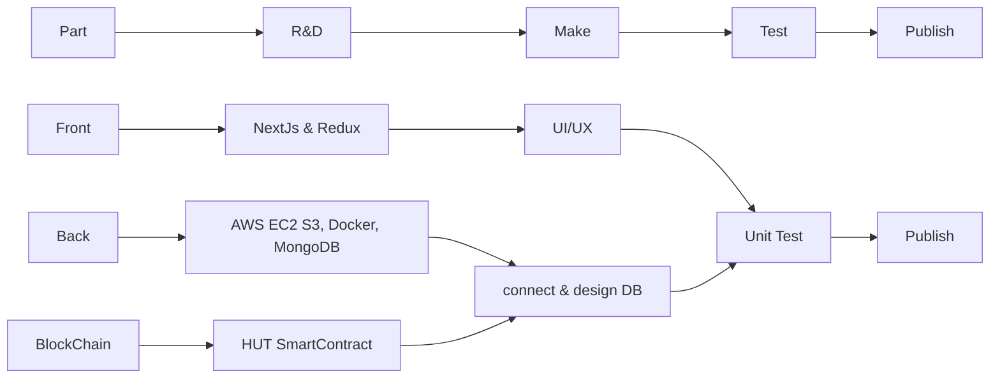

# Epsilon-Studio(Staking)

# 프로젝트 진행

---

 

# 프로젝트 개요 및 목표

 

개요 : 웹기반 NFT 마켓 플레이스 및 NFT스테이킹 & 토큰 스왑 및 거래 플랫폼
목표 : Polygon Matic을 자체 Token인 HUT으로 Swap 할 수 있는 환경을 구축하고 위스키 NFT를 Staking 하여 HUT를 보상해주는 DEX 사이트를 만들어 AWS에 배포해 보는 것이 목표입니다.

 
 

# 팀원 소개

팀장 : 박혜림 - Back-End

팀원 : 정재훈 - Blockchain

팀원 : 김정규 - Front-End

팀원 : 허재원 - Front-End

 

# STACK

### Front

    
    
    
     
    

### Back

    
    
    
    
    
    
    
    

### BlockChain

    
    
    
    
    

### ETC

    
    
    
    
    
    

